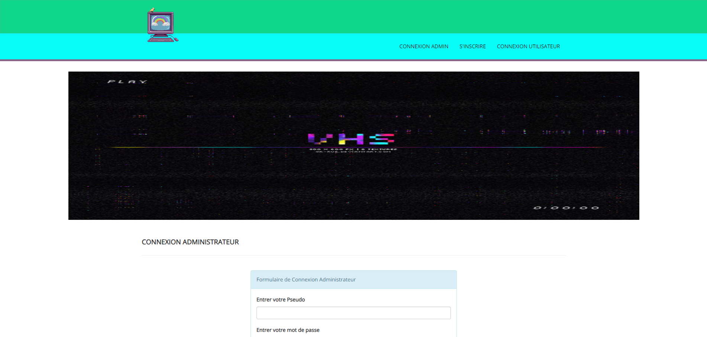
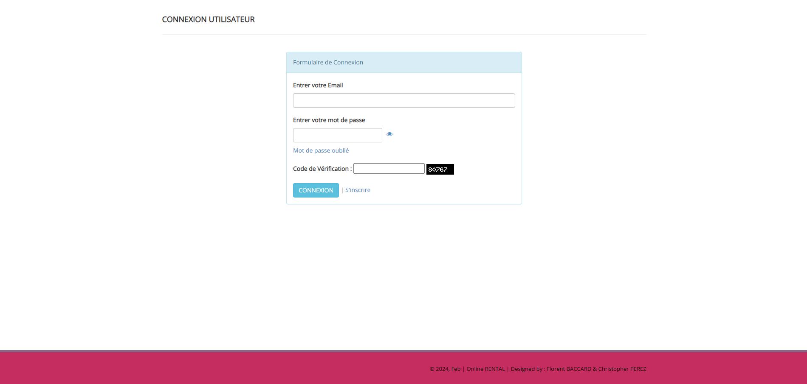
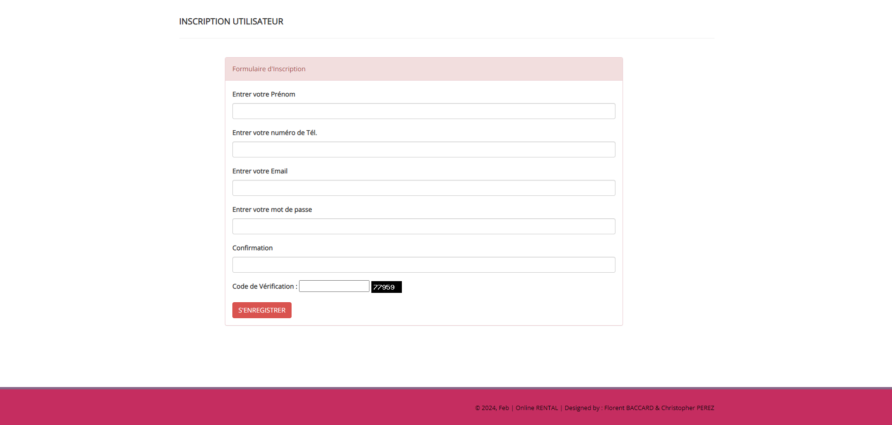
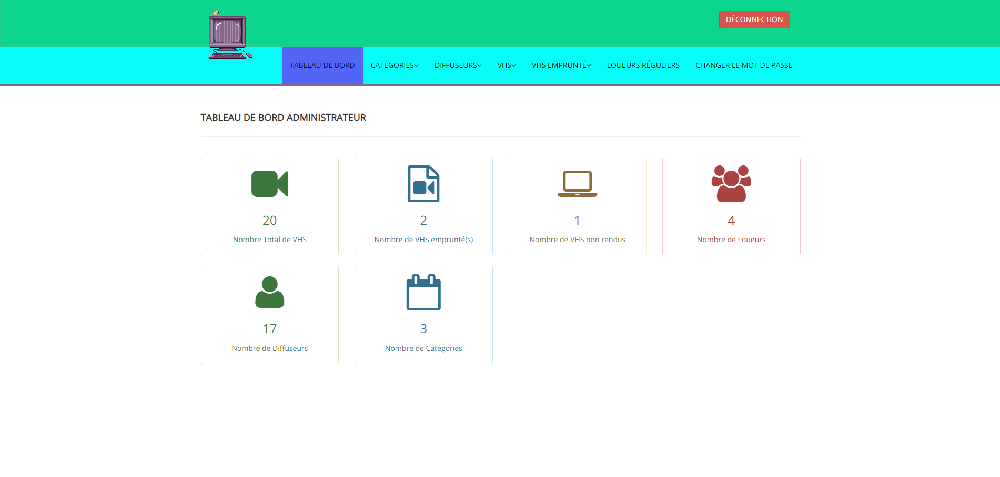
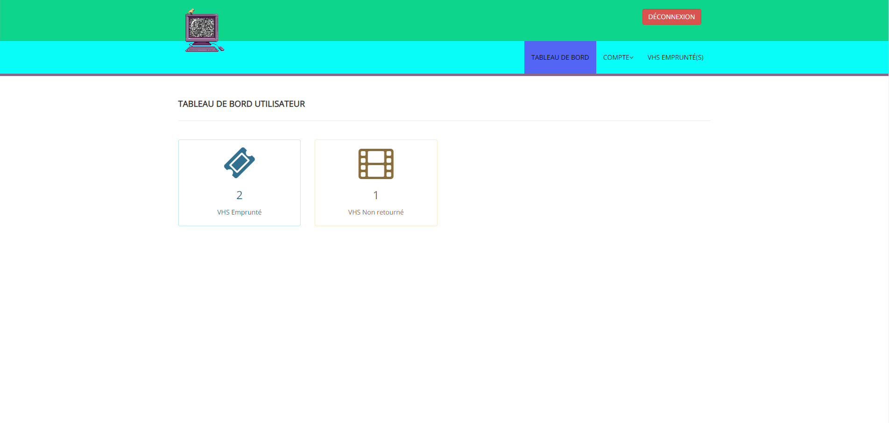

# 📼 ONLINE RENTAL #

Bienvenue sur notre projet Online RENTAL réalisé par <a href="https://github.com/florentbaccard" target="_blank"> Florent BACCARD</a> & <a href="https://github.com/Chr1stopherPerez" target="_blank"> Christopher PEREZ</a> !

L'objectif de ce projet était la création d'une bibliothéque de location en ligne de vhs. Projet demander au sein de notre formation proposée par <a href = 'https://www.onlineformapro.com/' target = "_blank" >OnlineFormaPro.</a>
 
Ce projet de location de VHS a été réalisé en Mysql, PHP, JavaScript, HTML, et CSS. L'interface à été pensé comme les anciens site remplis de couleurs diverses et varié.


## Fonctionnalités ##

- **Fonctions d'administration :**

L'administrateur a accès a son tableau de bord<br>
L'administrateur peut ajouter/mettre à jour/supprimer une catégorie<br>
L'administrateur peut ajouter/mettre à jour/supprimer des diffuseurs<br>
L'administrateur peut ajouter/mettre à jour/supprimer des vhs<br>
L'administrateur peut émettre un nouveau vhs au loueur et également mettre à jour les détails lorsque le loueur retourne le vhs<br>
L'administrateur peut avoir accès aux informations des loueurs<br>
L'administrateur peut changer son propre mot de passe<br>

- **Fonctions d'utilisateur :**

Le loueur peut s’inscrire lui-même et après l’inscription il obtiendra son id<br>
Le loueur a accès a son propre tableau de bord<br>
Le loueur peut mettre à jour son propre profil<br>
Le loueur peut voir le vhs émis et la date de retour du vhs<br>
Le loueur peut également changer son propre mot de passe ou le récupéré<br>


### Technologies Utilisées ###


#### Comment Exécuter le Projet Localement ####

1. Cloner ce référentiel sur votre machine locale.
2. Placer le dossier de la bibliothèque dans votre répertoire racine
3. Configurer la base de données, Ouvrir phpmyadmin, Créer une bibliothèque de bases de données
4. Importer la bibliothèque de base de données.sql<br>

5. Pour connecter un utilisateur<br>
Ouvrez votre navigateur et placez-le dans le navigateur "http://localhost/library"<br>

Informations de connexion pour l’utilisateur : Email > test@gmail.com & Mot de passe > Test@123<br>

6. Pour connecter l'administrateur<br>
Ouvrez votre navigateur, puis cliquez sur "http://localhost/library/admin"<br>

Informations de connexion pour l’administrateur : Nom d’utilisateur > admin & Mot de passe > admin@123

## Installation

1. Clonez le dépôt :

```bash
git clone https://github.com/florentbaccard/Projet_Agouti.git
cd Projet_Agouti

```
## Captures d'écran







